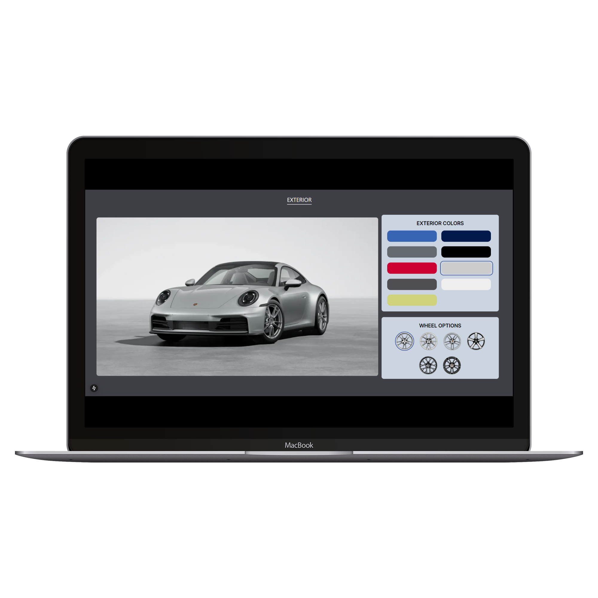
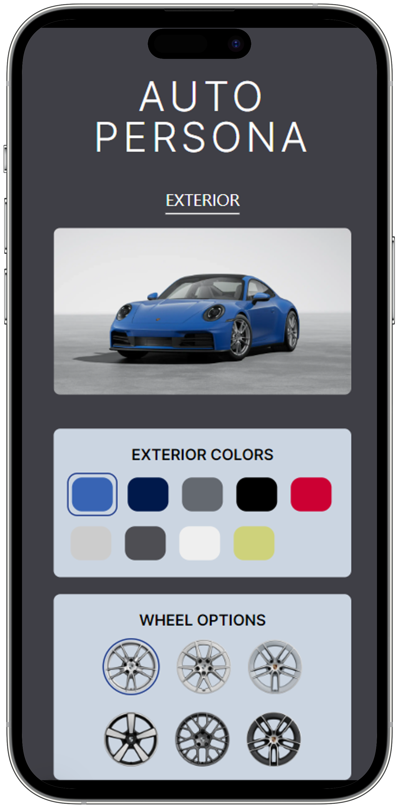
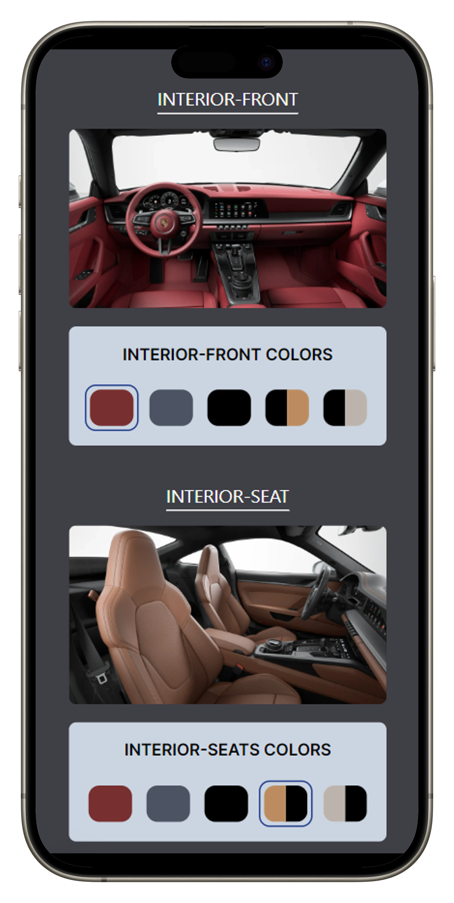

# Car Configurator Application

- This project is an interactive car configurator built with React and Next.js, allowing users to customize and preview various car features including exterior colors, wheels, interior colors, and seat designs.

## Features

1. Exterior Customization:
   - Change car colors with ExteriorConfigurator.
   - Update wheel options dynamically with real-time preview in ExteriorPreview.
2. Interior Customization:
   - Change interior colors with InteriorConfigurator and InteriorPreview.
   - Support for both single-tone and multi-tone designs.
3. Seat Customization:
   - Select and preview seat colors using InteriorSeatConfigurator and InteriorSeatPreview.
4. Dynamic State Management:
   - Centralized state to manage selected configurations using React’s useState.

## Preview

<div style="display: flex; justify-content: center; align-items: center; flex-direction:row;">
    
    
    
</div>


## Components Overview

1. HomePage
   - The main page integrating all configurators and previews with centralized state management.
2. ExteriorPreview
   - Displays the exterior preview with the selected car color and wheel option.
3. ExteriorConfigurator
   - Allows users to select exterior colors and wheel options dynamically.
4. InteriorPreview
   - Shows the preview of the car's front interior with the selected color.
5. InteriorConfigurator
   - Provides options for users to configure the interior color (supports dual-tone).
6. InteriorSeatPreview
   - Displays the preview of the car’s seat configuration based on the selected color.
7. InteriorSeatConfigurator
   - Allows users to select seat color options with support for dual-tone configurations.

## Installation and Setup

1. Clone the repository:
   ```bash
   git clone https://github.com/padmaja/Car-Configurator-App.git
   ```
2. Navigate to the project directory:
   ```bash
   cd Car-Configurator-App
   ```
3. Install dependencies:
   ```bash
   npm install
   ```
4. Start the development server:
   ```bash
   npm run dev
   ```
5. Open in your browser: Visit [http://localhost:3000](http://localhost:3000) .
